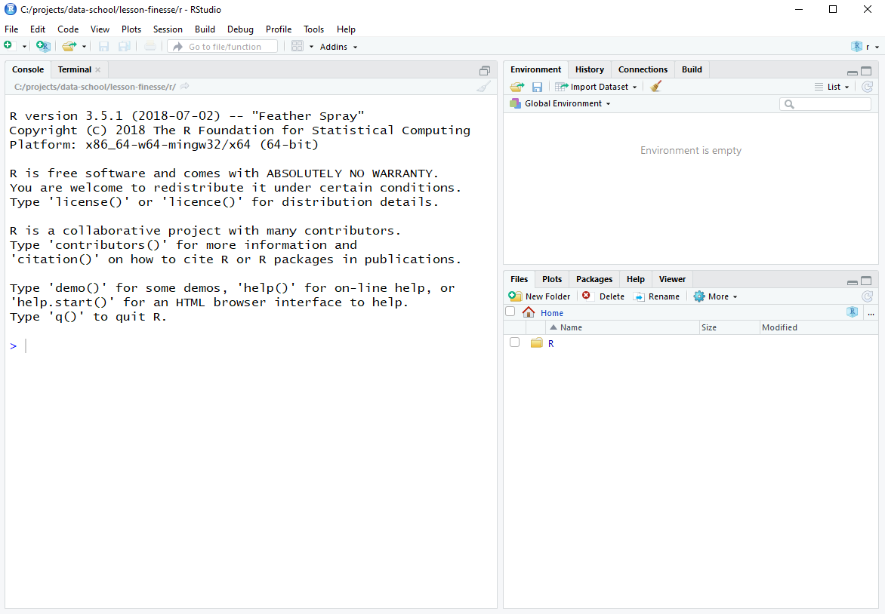
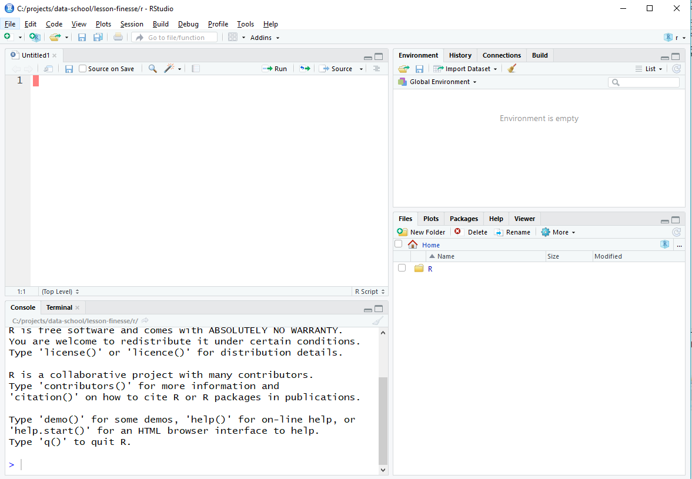

---
# Please do not edit this file directly; it is auto generated.
# Instead, please edit 01-R-and-RStudio.md in _episodes_rmd/
title:   Introduction to R and R Studio 
teaching: 20
exercises: 10
questions:
- "How do you find your way around RStudio?"
- "How do you interact with R?"
objectives:
- "Describe the purpose and use of each pane in the RStudio IDE"
- "Locate buttons and options in the RStudio IDE"
- "Manage a workspace in an interactive R session"
- "Manage packages"
keypoints:
- "Use RStudio to write and run R programs."
- "Set up an RStudio project for each analysis you are performing."
source: Rmd
---

## Why should you use R?

[What is R and what makes it different from the other software packages out there?] (https://select-statistics.co.uk/blog/what-is-r-and-why-should-you-use-it/)
Well, R is designed specifically for statistical computing and graphics.
It is free and open source, the latter meaning that anyone can interrogate the code to see what’s going on –  there’s no black box involved.
R provides a flexible analysis toolkit where all of the standard statistical techniques are built-in. 
Not only that, but there is a large R community who regularly contribute new functionality through add-on ‘packages’.
In fact, finding a particular statistical model or technique that is not already available through R is a tricky task indeed!

## Introduction to RStudio

Welcome to the R portion of the Software Carpentry workshop.

Throughout this lesson, we're going to teach you some of the fundamentals of
the R language as well as some best practices for organizing code for
scientific projects that will make your life easier.

We'll be using RStudio: a free, open source R integrated development
environment. It provides a built in editor, works on all platforms (including
on servers) and provides many advantages such as integration with version
control and project management.

**Basic layout**

When you first open RStudio, you will be greeted by three panels:

  * The interactive R console/terminal (entire left)
  * Environment/History (tabbed in upper right)
  * Files/Plots/Packages/Help/Viewer (tabbed in lower right)

Once you open files, such as R scripts, an editor panel will also open
in the top left.

You can move the panels around in RStudio so that their arrangement suits you.

## Work flow within RStudio
There are two main ways one can work within RStudio.

1. Test and play within the interactive R console then copy code into
a .R file to run later.
   *  This works well when doing small tests and initially starting off.
   *  It quickly becomes laborious
2. Start writing in an .R file and use RStudio's short cut keys for the Run command
to push the current line, selected lines or modified lines to the
interactive R console.
   * This is a great way to start; all your code is saved for later
   * You will be able to run the file you create from within RStudio
   or using R's `source()`  function.

> ## Tip: Running segments of your code
>
> RStudio offers you great flexibility in running code from within the editor
> window. There are buttons, menu choices, and keyboard shortcuts. To run the
> current line, you can 1. click on the `Run` button above the editor panel,
> or 2. select "Run Lines" from the "Code" menu, or 3. hit
> <kbd>Ctrl</kbd>+<kbd>Return</kbd> in Windows or Linux or
> <kbd>&#8984;</kbd>+<kbd>Return</kbd> on OS X. (This shortcut can also 
> be seen by hovering
> the mouse over the button). To run a block of code, select it and then `Run`.
> If you have modified a line of code within a block of code you have just run,
> there is no need to reselct the section and `Run`, you can use the next button
> along, `Re-run the previous region`. This will run the previous code block
> including the modifications you have made.
{: .callout}

## Introduction to R

Your time in R will be split between the R interactive
console working in scripts. The console is where you will run all of your code, and can be a useful environment to try out ideas before adding them to an R script
file. This console in RStudio is the same as the one you would get if
you typed in `R` in your command-line environment.

*Anything that you want to keep needs to go in a script.*

The first thing you will see in the R interactive session is a bunch
of information, followed by a ">" and a blinking cursor. In many ways
this is similar to the shell environment you learned about during the
shell lessons: it operates on the same idea of a "Read, evaluate,
print loop": you type in commands, R tries to execute them, and then
returns a result.

# Projects

R Studio provides in-built support for keeping all files associated with a project 
together.  This includes the input data, R Scripts, analytical results and figures.

A good project layout will ultimately make your life easier:

* It will help ensure the integrity of your data;
* It makes it simpler to share your code with someone else
(a lab-mate, collaborator, or supervisor);
* It allows you to easily upload your code with your manuscript submission;
* It makes it easier to pick the project back up after a break.

> ## Challenge: Creating a self-contained project
>
> We're going to create a new project in RStudio:
>
> 1. Click the "File" menu button, then "New Project".
> 2. Click "New Directory".
> 3. Click "Empty Project".
> 4. Type in the name of the directory to store your project, e.g. "intro-to-r".
> 5. Click the "Create Project" button.
{: .challenge}

Now when we start R in this project directory, or open this project with RStudio,
all of our work on this project will be entirely self-contained in this directory.

## Best practices for project organization

Although there is no "best" way to lay out a project, there are some general
principles to adhere to that will make project management easier:

### Treat raw data as read only

This is probably the most important goal of setting up a project. Data is
typically time consuming and/or expensive to collect. Working with them
interactively (e.g., in Excel) where they can be modified means you are never
sure of where the data came from, or how it has been modified since collection.
It is therefore a good idea to treat your raw data as "read-only".

### Data Cleaning

In many cases your data will be "dirty": it will need significant processing
to get into a useful format. This task is sometimes called "data munging". It is a good idea to have particular scripts just for the munging process.

### Treat generated output as disposable

Anything generated by your scripts should be treated as disposable: it should
all be able to be regenerated from your scripts.

> ## Tip: Good Enough Practices for Scientific Computing
>
> [Good Enough Practices for Scientific Computing](https://github.com/swcarpentry/good-enough-practices-in-scientific-computing/blob/gh-pages/good-enough-practices-for-scientific-computing.pdf) gives the following recommendations for project organization:
>
> 1. Put each project in its own directory, which is named after the project.
> 2. Put text documents associated with the project in the `doc` directory.
> 3. Put raw data and metadata in the `data` directory, and files generated during cleanup and analysis in a `results` directory.
> 4. Put source for the project's scripts and programs in the `src` directory, and programs brought in from elsewhere or compiled locally in the `bin` directory.
> 5. Name all files to reflect their content or function.
>
{: .callout}
> ## Tip: ProjectTemplate - a possible solution
>
> One way to automate the management of projects is to install the third-party package, `ProjectTemplate`.
> This package will set up an ideal directory structure for project management.
> This is very useful as it enables you to have your analysis pipeline/workflow organised and structured.
> Together with the default RStudio project functionality and Git you will be able to keep track of your
> work as well as be able to share your work with collaborators.
>
> 1. Install `ProjectTemplate`.
> 2. Load the library
> 3. Initialise the project:
>
> 
> ~~~
> install.packages("ProjectTemplate")
> library("ProjectTemplate")
> create.project("../my_project", merge.strategy = "allow.non.conflict")
> ~~~
> {: .language-r}
>
> For more information on ProjectTemplate and its functionality visit the
> home page [ProjectTemplate](http://projecttemplate.net/index.html)
{: .callout}

### Save the data in the data directory

Now we have a good directory structure we will now place/save the data file in the `data/` directory.

> ## Challenge 1
> Download the gapminder data from [here]({{ page.root }}/data/gapminder.csv).
>
> 1. Download the file (right mouse click -> "Save as")
> 2. Make sure it's saved under the name `gapminder.csv`
> 3. Save the file in the `data/` folder within your project.
>
> We will load and inspect these data later.
{: .challenge}
> ## Challenge 2
> It is useful to get some general idea about the dataset, directly from the
> command line, before loading it into R. Understanding the dataset better
> will come in handy when making decisions on how to load it in R. Use the command-line
> shell to answer the following questions:
> 1. What is the size of the file?
> 2. How many rows of data does it contain?
> 3. What kinds of values are stored in this file?
>
> > ## Solution to Challenge 2
> >
> > By running these commands in the shell:
> > 
> > ~~~
> > ls -lh data/gapminder.csv
> > ~~~
> > {: .language-r}
> > 
> > 
> > 
> > 
> > ~~~
> > -rwxrwxrwx 1 alex alex 81K Feb 25 13:13 data/gapminder.csv
> > ~~~
> > {: .output}
> > The file size is 80K.
> > 
> > ~~~
> > wc -l data/gapminder.csv
> > ~~~
> > {: .language-r}
> > 
> > 
> > 
> > 
> > ~~~
> > 1705 data/gapminder.csv
> > ~~~
> > {: .output}
> > There are 1705 lines. The data looks like:
> > 
> > ~~~
> > head data/gapminder.csv
> > ~~~
> > {: .language-r}
> > 
> > 
> > 
> > 
> > ~~~
> > country,continent,year,lifeExp,pop,gdpPercap
> > Afghanistan,Asia,1952,28.801,8425333,779.4453145
> > Afghanistan,Asia,1957,30.332,9240934,820.8530296
> > Afghanistan,Asia,1962,31.997,10267083,853.10071
> > Afghanistan,Asia,1967,34.02,11537966,836.1971382
> > Afghanistan,Asia,1972,36.088,13079460,739.9811058
> > Afghanistan,Asia,1977,38.438,14880372,786.11336
> > Afghanistan,Asia,1982,39.854,12881816,978.0114388
> > Afghanistan,Asia,1987,40.822,13867957,852.3959448
> > Afghanistan,Asia,1992,41.674,16317921,649.3413952
> > ~~~
> > {: .output}
> {: .solution}
{: .challenge}
> ## Tip: command line in R Studio
>
> You can quickly open up a shell in RStudio using the **Tools -> Shell...** menu item.
{: .callout}

